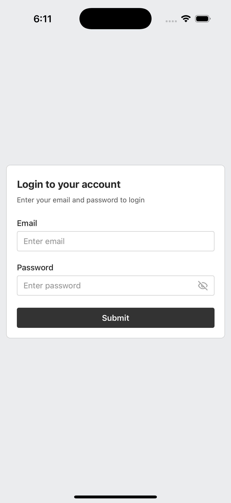
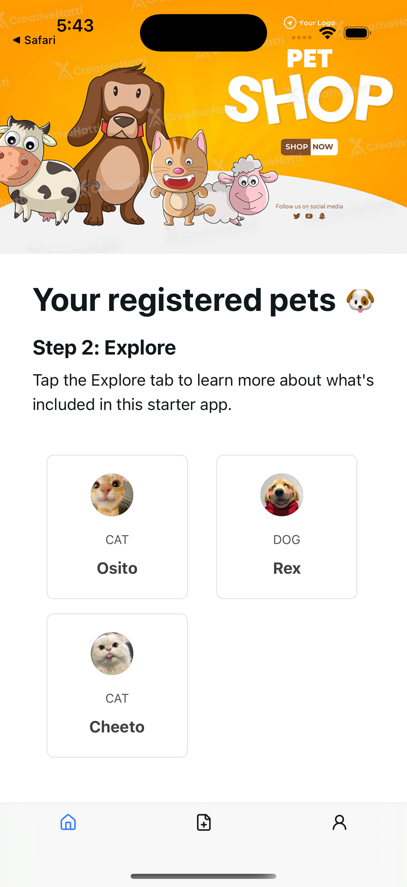
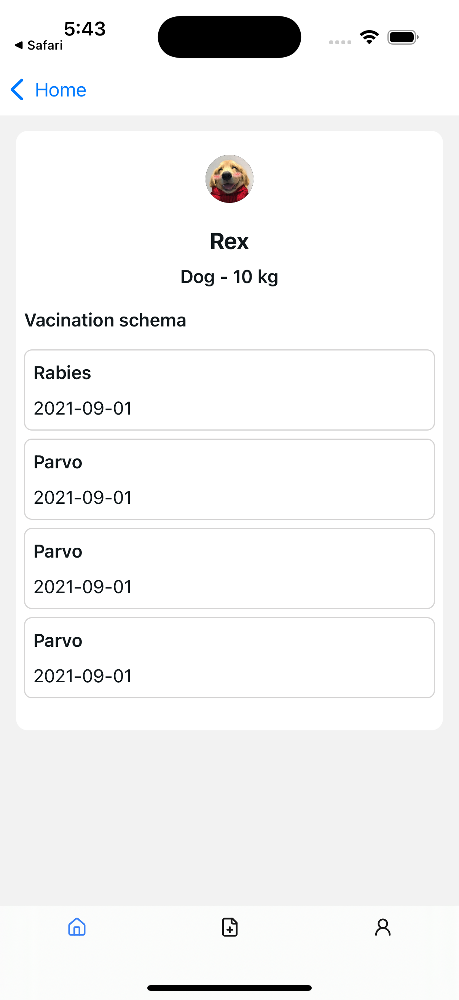
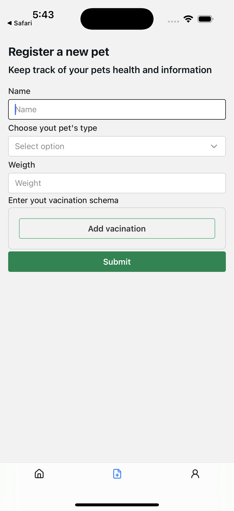

# Welcome to Cartilla digital para mascotas 👋

Proyecto realizado como challenge para goatpass

## El proyecto

El proyecto tiene como fin generar una forma de registrar las vacunas de las mascotas de un usuario, para ello se debe registrar la mascota y las vacunas que esta ha recibido.

### Tecnologías utilizadas
- React Native
- Expo
- Tailwind CSS

### Limitaciones
- No se ha implementado un backend para almacenar los datos de las mascotas y las vacunas, por lo que se utiliza un sistema de mocks para simular la persistencia de los datos.
- Al no tener una cuenta como developer en Google y Apple, no se ha podido implementar el build con Expo para las tiendas de aplicaciones.
  
### Mocks
- Para simular la persistencia de los datos se ha creado una carpeta llamada **mocks** dentro de la carpeta **api** la cual es una carpeta espejo de la carpeta **real** la cual tiene implementado los metodos para la llamada a la API.
- Dentro de cada recurso se encuentra un archivo con sufijo **-response** el cual contiene la respuesta que se obtendría de la API y puede ser modificada para simular diferentes respuestas.
- Para cambiar de tipo de respuesta se puede cambiar en cada llamada de forma independiete para simular errores en llamadas especificas.
- Cualquier combinacion de email y password es valida para el login, ya que no se valida contra una base de datos.

### Screenshots
<p align="center">
  
</p>
<p align="center">
  
</p>
<p align="center">
  
</p>
<p align="center">
  
</p>

## 🚀 Quick start

1. Install dependencies

   ```bash
   npm install
   ```

2. Start the app

   ```bash
    npx expo start
   ```


3. Any email and password can be used to login, as the login is mocked.

In the output, you'll find options to open the app in a

- [development build](https://docs.expo.dev/develop/development-builds/introduction/)
- [Android emulator](https://docs.expo.dev/workflow/android-studio-emulator/)
- [iOS simulator](https://docs.expo.dev/workflow/ios-simulator/)
- [Expo Go](https://expo.dev/go), a limited sandbox for trying out app development with Expo

You can start developing by editing the files inside the **app** directory. This project uses [file-based routing](https://docs.expo.dev/router/introduction).

